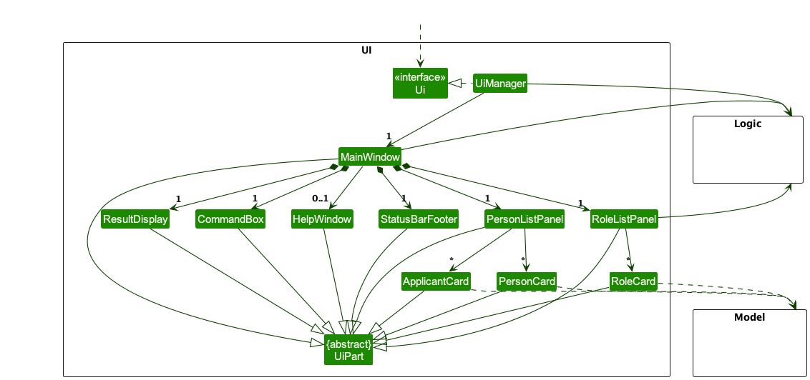
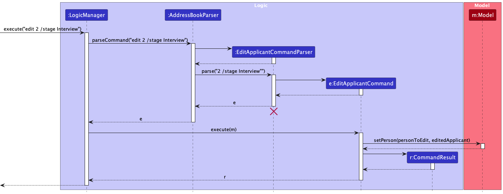

* Table of Contents
{:toc}

--------------------------------------------------------------------------------------------------------------------

## **Acknowledgements**

* This project is based on the AddressBook-Level3 project created by the [SE-EDU initiative](https://se-education.org).

--------------------------------------------------------------------------------------------------------------------

## **Setting up, getting started**

Refer to the guide [_Setting up and getting started_](SettingUp.md).

--------------------------------------------------------------------------------------------------------------------

## **Design**

:bulb: **Tip:** The `.puml` files used to create diagrams in this document `docs/diagrams` folder. Refer to the [_PlantUML Tutorial_ at se-edu/guides](https://se-education.org/guides/tutorials/plantUml.html) to learn how to create and edit diagrams.

### Architecture

The ***Architecture Diagram*** given above explains the high-level design of the App.

Given below is a quick overview of main components and how they interact with each other.

**Main components of the architecture**

**`Main`** (consisting of classes [`Main`](https://github.com/AY2324S2-CS2103-F15-3/tp/tree/master/src/main/java/seedu/address/Main.java) and [`MainApp`](https://github.com/AY2324S2-CS2103-F15-3/tp/tree/master/src/main/java/seedu/address/MainApp.java)) is in charge of the app launch and shut down.
* At app launch, it initializes the other components in the correct sequence, and connects them up with each other.
* At shut down, it shuts down the other components and invokes cleanup methods where necessary.

The bulk of the app's work is done by the following four components:

* [**`UI`**](#ui-component): The UI of the App.
* [**`Logic`**](#logic-component): The command executor.
* [**`Model`**](#model-component): Holds the data of the App in memory.
* [**`Storage`**](#storage-component): Reads data from, and writes data to, the hard disk.

[**`Commons`**](#common-classes) represents a collection of classes used by multiple other components.

**How the architecture components interact with each other**

The *Sequence Diagram* below shows how the components interact with each other for the scenario where the user issues the command `delete 1`.

Each of the four main components (also shown in the diagram above),

* defines its *API* in an `interface` with the same name as the Component.
* implements its functionality using a concrete `{Component Name}Manager` class (which follows the corresponding API `interface` mentioned in the previous point.

For example, the `Logic` component defines its API in the `Logic.java` interface and implements its functionality using the `LogicManager.java` class which follows the `Logic` interface. Other components interact with a given component through its interface rather than the concrete class (reason: to prevent outside component's being coupled to the implementation of a component), as illustrated in the (partial) class diagram below.

The sections below give more details of each component.

### UI component

The **API** of this component is specified in [`Ui.java`](https://github.com/AY2324S2-CS2103-F15-3/tp/tree/master/src/main/java/seedu/address/ui/Ui.java)

The UI consists of a `MainWindow` that is made up of parts e.g.`CommandBox`, `ResultDisplay`, `PersonListPanel`, `RoleListPanel`, `StatusBarFooter` etc. All these, including the `MainWindow`, inherit from the abstract `UiPart` class which captures the commonalities between classes that represent parts of the visible GUI.

The `UI` component uses the JavaFx UI framework. The layout of these UI parts are defined in matching `.fxml` files that are in the `src/main/resources/view` folder. For example, the layout of the [`MainWindow`](https://github.com/AY2324S2-CS2103-F15-3/tp/tree/master/src/main/java/seedu/address/ui/MainWindow.java) is specified in [`MainWindow.fxml`](https://github.com/AY2324S2-CS2103-F15-3/tp/tree/master/src/main/resources/view/MainWindow.fxml)

The `UI` component,

* executes user commands using the `Logic` component.
* listens for changes to `Model` data so that the UI can be updated with the modified data.
* keeps a reference to the `Logic` component, because the `UI` relies on the `Logic` to execute commands.
* depends on some classes in the `Model` component, as it displays `Person` object residing in the `Model`.

### Logic component

**API** : [`Logic.java`](https://github.com/AY2324S2-CS2103-F15-3/tp/tree/master/src/main/java/seedu/address/logic/Logic.java)

Here's a (partial) class diagram of the `Logic` component:

The sequence diagram below illustrates the interactions within the `Logic` component, taking `execute("delete 1")` API call as an example.

:information_source: **Note:** The lifeline for `DeleteCommandParser` should end at the destroy marker (X) but due to a limitation of PlantUML, the lifeline continues till the end of diagram.

How the `Logic` component works:

1. When `Logic` is called upon to execute a command, it is passed to an `AddressBookParser` object which in turn creates a parser that matches the command (e.g., `DeleteCommandParser`) and uses it to parse the command.
1. This results in a `Command` object (more precisely, an object of one of its subclasses e.g., `DeleteCommand`) which is executed by the `LogicManager`.
1. The command can communicate with the `Model` when it is executed (e.g. to delete a person). 
   Note that although this is shown as a single step in the diagram above (for simplicity), in the code it can take several interactions (between the command object and the `Model`) to achieve.
1. The result of the command execution is encapsulated as a `CommandResult` object which is returned back from `Logic`.

Here are the other classes in `Logic` (omitted from the class diagram above) that are used for parsing a user command:

How the parsing works:
* When called upon to parse a user command, the `AddressBookParser` class creates an `XYZCommandParser` (`XYZ` is a placeholder for the specific command name e.g., `AddCommandParser`) which uses the other classes shown above to parse the user command and create a `XYZCommand` object (e.g., `AddCommand`) which the `AddressBookParser` returns back as a `Command` object.
* All `XYZCommandParser` classes (e.g., `AddCommandParser`, `DeleteCommandParser`, ...) inherit from the `Parser` interface so that they can be treated similarly where possible e.g, during testing.

### Model component
**API** : [`Model.java`](https://github.com/AY2324S2-CS2103-F15-3/tp/tree/master/src/main/java/seedu/address/model/Model.java)

The `Model` component,

* stores the address book data i.e., all `Person` objects (which are contained in a `UniquePersonList` object).
* stores the currently 'selected' `Person` objects (e.g., results of a search query) as a separate _filtered_ list which is exposed to outsiders as an unmodifiable `ObservableList<Person>` that can be 'observed' e.g. the UI can be bound to this list so that the UI automatically updates when the data in the list change.
* stores a `UserPref` object that represents the user’s preferences. This is exposed to the outside as a `ReadOnlyUserPref` objects.
* does not depend on any of the other three components (as the `Model` represents data entities of the domain, they should make sense on their own without depending on other components)

:information_source: **Note:** An alternative (arguably, a more OOP) model is given below. It has a `Tag` list in the `AddressBook`, which `Person` references. This allows `AddressBook` to only require one `Tag` object per unique tag, instead of each `Person` needing their own `Tag` objects. 

### Storage component

**API** : [`Storage.java`](https://github.com/AY2324S2-CS2103-F15-3/tp/tree/master/src/main/java/seedu/address/storage/Storage.java)

The `Storage` component,
* can save both address book data and user preference data in JSON format, and read them back into corresponding objects.
* inherits from both `AddressBookStorage` and `UserPrefStorage`, which means it can be treated as either one (if only the functionality of only one is needed).
* depends on some classes in the `Model` component (because the `Storage` component's job is to save/retrieve objects that belong to the `Model`)

### Common classes

Classes used by multiple components are in the `seedu.addressbook.commons` package.

--------------------------------------------------------------------------------------------------------------------

## **Implementation**

This section describes some noteworthy details on how certain features are implemented.

### \[Developed\] Applicant class OOP modeling
#### Why it is implemented that way
By extending `Person`, the `ModelManager` and `AddressBook` classes can remain the same handling person
(as observed in the diagram in Model component). Since `Applicant` is also a person with additional fields, it makes
sense for the model to have `Applicant` class extend `Person` and composing of classes like `Role` and `Stage` which are
the new details we are tracking.
Similarly, a `JsonAdaptedApplicant` extends `JsonAdaptedPerson` to achieve
the same effect in `Storage` component.

### \[Developed\] Add applicant feature
The add applicant feature allows users to add applicants with the following details: `Name`, `Phone`, `Email`,
`Address`, `Role`, `Tag`, `Note` and `Date`.

#### How the feature is implemented
* The add applicant is designed in mind with how the `Applicant` class extends `Person` class
to maximize the benefits of inheritance.
* In the add applicant command and parser, the applicant is parse to into `addPerson()` as `Applicant`.
* In the `JsonAdaptedPerson` class, subtype declarators are used to declare the inheritance relationship between person
and applicant, hence it can store and differentiate applicants from person when retrieved.
* There is also an input checker reminding users to not declare `/stage` (if they did) as newly added applicants are
assumed to be at the `'Initial Application'` stage.
* Instance check are done for `Applicant` at `personListPanel` to ensure the applicant card gets displayed and
`JsonSerializableAddressBook` class to ensure the person objects that are `Applicant` are casted accordingly.

### \[Developed\] Edit applicant feature
The `edit` command gives users the ability to edit the applicants' details. The details that can be edited include `Name`, `Phone`, `Email`, `Address`, `Stage`, `Role`, `Note` and `Tag`. Note that at least one field has to be chosen.

#### How the feature is implemented
* The `edit` is implemented using the `EditApplicantCommand`, `EditApplicantDescriptor` and `EditApplicantCommandParser` classes.
* The `EditApplicantCommand` receives an index of the applicant to be edited and an EditApplicantDescriptor class which consists of the updated fields of the applicant.
* Note that checks will be done on the fields that the user want to input to ensure is valid. For example, `Stage` can only be one of the four forms `Initial Application`, `Technical Assessment`, `Interview`, `Decision & Offer`. Hence, if user was to input `edit 1 /stage WaitListed`, this will not be possible and the applicant will not be edited.
* Similarly, a check will be done to ensure that the index is valid.

### \[Developed\] Note feature
* The `note` command gives users the ability to add notes to applicants. There is also an option to add a timestamp to the note to date it.
* Arguments for this command is `note`, `index`, and `date`, where `note` is the note content, `index` being which applicant in the list to add to, and `date` to specify whether the timestamp should be added.
* An example usage of the command is `note 1 /note Buy groceries /date true`

This feature is implemented by first adding an additional `Note` property to the `Person` model, as illustrated by the UML diagram below:

* This allows the `Note` property to be stored in the `Person` model for further manipulation during program runtime.
* Then, the `storage` component is modified to also include the `Note` property, so that when the program saves the applicant, the `Note` will also be saved into `addressbook.json`

* The following class diagram shows the design of the `Note` command:

* As mentioned earlier, the `Note` command has an optional `date` that can be attached to a `note`.
* In the class diagram above, the toggle for adding the `date` is stored as a boolean `withDate`.
* When `withDate` is set to true, a date `String` is then generated when `generateDate()` is called.
* The reason for not saving the `date` as an actual date related data type is due to the fact that it will always default to the current timestamp when the note is added.
* For convenience and to avoid the need to cast date datatype, the actual `date` for the note is stored as a `String`, which can be directly saved into `.json` files.

#### Design considerations:

**Aspect: How Note dates are stored:**

* **Alternative 1 (current choice):** Simply stored as a `String`.
    * Pros: Straightforward and easy.
    * Cons: Is not searchable/sortable unlike actual date datatype.

* **Alternative 2:** Store date with proper date datatype.
    * Pros: Can be searchable/sortable in the future if the need arises.
    * Cons: Takes more time to implement as it needs to be added to Model, Storage, and `NoteCommand` needs to be modified.

### \[Developed\] Import feature
The `import` command allows users to import the applicants' contacts easily. The command opens an import window with file selector feature to have the user select a file.
Once a file is selected and user clicks on import, an `import_file` command is sent along with the filepath.
This enables users that are less tech-savvy to use the GUI to select the file while users confident with directly typing out the filepath to use the `import_file` command directly.
Only json file exported from HRConnect will be recognised.

#### Why is it implemented that way
HRConnect is a CLI-optimised application and the optimal choice was to implement a CLI command that takes in a file path to
import file than just directly importing contacts to `Logic` straight from the `MainWindow`. This reduces direct coupling from
the UI to the logic components and maintains the facade design pattern.

--------------------------------------------------------------------------------------------------------------------

## **Documentation, logging, testing, configuration, dev-ops**

* [Documentation guide](Documentation.md)
* [Testing guide](Testing.md)
* [Logging guide](Logging.md)
* [Configuration guide](Configuration.md)
* [DevOps guide](DevOps.md)

--------------------------------------------------------------------------------------------------------------------

## **Appendix: Requirements**

### Product scope

**Target user profile**: HR officer for tech-related startup

**Value proposition**:
* Managing contacts for three main types of external liaisons:
  * potential hires
  * hiring agencies
  * legal consultants
*  Reduce time spent on searching for relevant contacts for liaisons.

### User stories

Priorities: Essential (needed for basic functionality) - `Essential`, Typical (common needs) - `Typical`, Novel (good to have but not a need) - `Novel`, Out of Scope (not needed) - `Out of Scope`

| As a/an ...                      | I can ...                                                                                                                                                                | So that ...                                                                                          | Priority (Essential, Typical, Novel, Out of Scope) |
| -------------------------------- | ------------------------------------------------------------------------------------------------------------------------------------------------------------------------ |------------------------------------------------------------------------------------------------------|----------------------------------------------------|
| User                             | add new contacts                                                                                                                                                         |                                                                                                      | Essential                                          |
| User                             | delete existing contacts                                                                                                                                                 |                                                                                                      | Essential                                          |
| User                             | view existing contacts                                                                                                                                                   |                                                                                                      | Essential                                          |
| HR professional                  | manage all my work contacts in one place,                                                                                                                                | I can efficiently communicate with applicants                                                        | Essential                                          |
| User                             | update existing contacts                                                                                                                                                 |                                                                                                      | Typical                                            |
| User                             | purge all curent data                                                                                                                                                    | I can get rid of sample/experimental data I while exploring the app                                  | Typical                                            |
| HR Recruiter                     | filter through my contact list based on what stage of the hiring process the applicants are in                                                                           | I can contact those who are shortlisted                                                              | Typical                                            |
| HR Recruiter                     | add tags to contacts to specify which roles they are applying for                                                                                                        | I can keep them organized                                                                            | Typical                                            |
| HR personnel                     | add notes or comments to individual contact entries                                                                                                                      | I can keep track of important additional information/interactions                                    | Typical                                            |
| experienced HR professional      | filter and identify candidates by tags                                                                                                                                   | I can follow up with them promptly                                                                   | Typical                                            |
| User                             | search through my contacts based on specific criteria                                                                                                                    | I can quickly find any information I need                                                            | Typical                                            |
| HR Recruiter                     | extract contacts into a separate address book                                                                                                                            | I can import them to the company database easily                                                     | Typical                                            |
| HR Recruiter                     | upload images to set profile pictures for my contacts                                                                                                                    | I can identify them when face to face                                                                | Typical                                            |
| first-time user                  | have an intuitive experience and can quickly understand its features and functionalities                                                                                 | I can start using it effectively without wasting time                                                | Typical                                            |
| first-time user                  | can find clear instructions on how to use HRConnect                                                                                                                      | I can easily start managing my contacts using HRConnect                                              | Typical                                            |
| HR Recruiter                     | Create new contacts with templates based on person (employees, intern, interviewee etc.)                                                                                 |                                                                                                      | Novel                                              |
| long-time user                   | create shortcuts for tasks                                                                                                                                               | I can save time on frequenty used functions                                                          | Novel                                              |
| User                             | receive notifications or reminders from HRConnect                                                                                                                        | I can be kept up to date with upcoming interviews, deadlines or follow-up tasks                      | Novel                                              |
| User                             | can conduct background checks on potential hires directly within HRConnect                                                                                               | I can find out the suitability of a candidate easily                                                 | Novel                                              |
| first-time user                  | easily import my data                                                                                                                                                    | it won't be intimidating and I won't give up on using it after my first use                          | Novel                                              |
| HR personnel                     | sync any information changes across different devices                                                                                                                    | I can update information efficiently and ensure that all data is up to date for my coworkers as well | Novel                                              |
| long-time user.                  | archive/hide unused contacts                                                                                                                                             | I am not distracted by irrelevant data                                                               | Novel                                              |
| HR Recruiter                     | create custom automated processes for repetitive tasks                                                                                                                   | I can save time on such tasks                                                                        | Novel                                              |
| potential user exploring the app | see the app populated with sample data                                                                                                                                   | I can easily see the benefits of the app when frequently used                                        | Novel                                              |
| HR personnel                     | keep track of the status of job applications or recruitment processes for each candidate                                                                                 | I can monitor progress and follow up as needed                                                       | Novel                                              |
| User                             | track the status of each potential hire in the recruitment process                                                                                                       | I can take action as needed                                                                          | Novel                                              |
| User                             | conduct surveys and collect feedback from specific groups within my contacts                                                                                             | I can easily conduct surveys as needed                                                               | Novel                                              |
| first-time user                  | access a brief tutorial on how to navigate HRConnect                                                                                                                     | I can quickly familiarize myself with its features and functions                                     | Out of scope                                       |
| User                             | generate reports or analytics on hiring activities such as time-to-fill metrics, source of hire, and diversity statistics                                                | I can easily access such information as needed                                                       | Out of scope                                       |
| User                             | integrate HRConnect with other HR systems or tools such as applicant tracking systems or payroll software                                                                | data exchange and workflows can be streamlined                                                       | Out of scope                                       |
| User                             | schedule and conduct virtual interviews directly within HRConnect, including video conferencing and interview notes                                                      |                                                                                                      | Out of scope                                       |
| User                             | track and manage employee referrals and incentives programs within HRConnect, including tracking referral bonuses and monitoring the effectiveness of referral campaigns |                                                                                                      | Out of scope                                       |
| User                             | generate customizable offer letters and employment contracts directly within HRConnect, including integrating e-signature solutions                                      | I can perform these tasks more efficiently                                                           | Out of scope                                       |
| User                             | create and manage employee development plans with HRConnect                                                                                                              |                                                                                                      | Out of scope                                       |
| User                             | create and manage succession plans with HRConnect, including identifying high-potential employees, mapping career paths and planning for leadership transitions          |                                                                                                      | Out of scope                                       |

### Use cases

(For all use cases below, the **System** is the `HRConnect` and the **Actor** is the `user`, unless specified otherwise)

**Use case: Add an applicant**

**MSS**

1.  User requests to list of contacts
2.  HRConnect shows a list of contacts
3.  User requests to add a specific contact to the list
4.  HRConnect adds the contact

    Use case ends.

**Extensions**

* 3a. The given format is invalid.

    * 3a1. HRConnect shows an error message.

      Use case resumes at step 2.

* 3b. The unnecessary fields given.

    * 3a1. HRConnect shows an error message.

      Use case resumes at step 2.

* 3c. The contact details have been added before.

    * 3b1. HRConnect shows an error message.

      Use case resumes at step 2.

**Use case: Clear**

**MSS**

1.  User requests to list of contacts
2.  HRConnect shows a list of contacts
3.  User requests to clear the list
4.  HRConnect deletes all entries in list

    Use case ends.

**Extensions**

* 2a. The list is empty.

  Use case ends.

**Use case: Add comment to contact**

**MSS**

1.  User requests to list of contacts
2.  HRConnect shows a list of contacts
3.  User requests to add a comment to a specific person in the list
4.  HRConnect adds comment to the person

    Use case ends.

**Extensions**

* 2a. The list is empty.

  Use case ends.

* 3a. The given Application ID is invalid.

    * 3a1. HRConnect shows an error message.

      Use case resumes at step 2.

* 3b. The comment is empty.

    * 3b1. HRConnect shows an error message.

      Use case resumes at step 2.

* 3c. The comment is a duplicate of a previous comment assigned to the same contact.

    * 3c1. HRConnect shows an error message.

      Use case resumes at step 2.

**Use case: Delete a contact**

**MSS**

1.  User requests to list of contacts
2.  HRConnect shows a list of contacts
3.  User requests to delete a specific contact on the list
4.  HRConnect deletes the person

    Use case ends.

**Extensions**

* 2a. The list is empty.

  Use case ends.

* 3a. The given index is invalid.

    * 3a1. HRConnect shows an error message.

      Use case resumes at step 2.

**Use case: Edit a person**

**MSS**

1.  User requests to list of contacts
2.  HRConnect shows a list of contacts
3.  User requests to edit a specific person's details in the list
4.  HRConnect edits the details belonging to the person

    Use case ends.

**Extensions**

* 2a. The list is empty.

  Use case ends.

* 3a. The given index of the person is invalid.

    * 3a1. HRConnect shows an error message.

      Use case resumes at step 2.

* 3b. The given format of the command is invalid.

    * 3b1. HRConnect shows an error message.

      Use case resumes at step 2.

**Use case: Export contacts**

**MSS**

1.  User requests to list of contacts
2.  HRConnect shows a list of contacts
3.  User requests to export contacts into a separate address book section.
4.  HRConnect exports the specified range of contacts to the designated page.

    Use case ends.

**Extensions**

* 2a. The list is empty.

  Use case ends

* 3a. The given format of the command is invalid.

    * 3a1. HRConnect shows an error message.

      Use case resumes at step 2.

* 3b. The given range is invalid.

    * 3b1. HRConnect shows an error message.

      Use case resumes at step 2.

**Use case: Filter Tag**

**MSS**

1.  User requests to list of contacts
2.  HRConnect shows a list of contacts
3.  User requests to filter through the contact list based on what stage the interviewee is in
4.  HRConnect returns entries only for interviewees in that particular stage.

    Use case ends.

**Extensions**

* 2a. The list is empty.

  Use case ends

* 3a. The given format of the command is invalid.

    * 3a1. HRConnect shows an error message.

      Use case resumes at step 2.

* 3b. The tag does not exist.

    * 3b1. HRConnect shows an error message.

      Use case resumes at step 2.

**Use case: Find keyword**

**MSS**

1.  User requests to list of contacts
2.  HRConnect shows a list of contacts
3.  User requests to find entries that match the keyword in the list
4.  HRConnect returns entries that match the keyword

    Use case ends.

**Extensions**

* 2a. The list is empty.

  Use case ends

**Use case: List**

**MSS**

1.  User requests to list persons
2.  AddressBook shows a list of persons

    Use case ends.

**Extensions**

* 2a. The list is empty.

  Use case ends

**Use case: Add tag**

**MSS**

1.  User requests to list of contacts
2.  HRConnect shows a list of contacts
3.  User requests to add specific tags to specific contacts for easy filtering later.
4.  HRConnect adds the specified tag to the designated contact.

    Use case ends.

**Extensions**

* 2a. The list is empty.

* 3a. The application ID does not exist.

    * 3a1. HRConnect shows an error message.

      Use case resumes at step 2.

* 3b. The tag does not exist.

    * 3b1. HRConnect shows an error message.

      Use case resumes at step 2.

  Use case ends

**Use case: Import contacts (through GUI)**

**MSS**

1.   User requests to import new contacts
2.   System prompts the user to select file
3.   User selects the file containing the contacts
4.   System adds new contacts into the current lists
5.   System shows the lists of contacts

Use case ends.

**Extensions**

* 2a. The file is invalid or no file selected.

    * 2a1. System shows an error message.

      Use case resumes at step 1.

**Use case: Import contacts (through CLI)**

**MSS**

1.   User requests to import new contacts and enters the file path
2.   System adds new contacts into the current lists
3.   System shows the lists of contacts

Use case ends.

**Extensions**

* 1a. File selected is incorrect or no file is selected.

    * 1a1. HRConnect shows an error message.

      Use case resumes at step 1.

### Non-Functional Requirements

1.  Should work on any _mainstream OS_ as long as it has Java `11` or above installed.
2.  Should be able to hold up to 1000 persons without a noticeable sluggishness in performance for typical usage.
3.  A user with above average typing speed for regular English text (i.e. not code, not system admin commands) should be able to accomplish most of the tasks faster using commands than using the mouse.
4. Searches, additions, and updates to contacts should be processed within 2 seconds under normal operational conditions.
5. HRConnect should feature an intuitive user interface for easy management of contacts without prior training.
6. The system should provide clear error messages and guidance for correcting invalid inputs.
7. The system should be designed to scale horizontally to accommodate growing numbers of users and contacts.
8. It should maintain performance and usability as data volume and number of concurrent users increase.
9. HRConnect should be available 24/7 with a target uptime of 99.9%, excluding scheduled maintenance.
10. It should include mechanisms for data backup and recovery to prevent data loss.
11. The system should be compatible with major operating systems (Windows, macOS, Linux) and browsers (Chrome, Firefox, Safari).
12. The application should be built using modular, well-documented code to facilitate maintenance and future updates.
13. It should allow for the easy addition of new features without significant restructuring of the existing codebase.

### Glossary

* **Mainstream OS**: Windows, Linux, Unix, MacOS
* **Applicants**: People who are applying to the company
* **Time-to-fill**: The time taken to find and hire a new candidate

--------------------------------------------------------------------------------------------------------------------

## **Appendix: Instructions for manual testing**

Given below are instructions to test the app manually.

:information_source: **Note:** These instructions only provide a starting point for testers to work on;
testers are expected to do more *exploratory* testing.

### Launch and shutdown

1. Initial launch

   1. Download the jar file and copy into an empty folder

   1. Double-click the jar file Expected: Shows the GUI with a set of sample contacts. The window size may not be optimum.

1. Saving window preferences

   1. Resize the window to an optimum size. Move the window to a different location. Close the window.

   1. Re-launch the app by double-clicking the jar file. 
       Expected: The most recent window size and location is retained.

1. _{ more test cases …​ }_

### Deleting a person

1. Deleting a person while all persons are being shown

   1. Prerequisites: List all persons using the `list` command. Multiple persons in the list.

   1. Test case: `delete 1` 
      Expected: First contact is deleted from the list. Details of the deleted contact shown in the status message. Timestamp in the status bar is updated.

   1. Test case: `delete 0` 
      Expected: No person is deleted. Error details shown in the status message. Status bar remains the same.

   1. Other incorrect delete commands to try: `delete`, `delete x`, `...` (where x is larger than the list size) 
      Expected: Similar to previous.

1. _{ more test cases …​ }_

### Saving data

1. Dealing with missing/corrupted data files

   1. _{explain how to simulate a missing/corrupted file, and the expected behavior}_

1. _{ more test cases …​ }_
--------------------------------------------------------------------------------------------------------------------

## **Appendix: Planned Enhancements**

**Note:** There are 5 people in our team, allowing us to have 2 x 5 = 10 planned enhancements.

1. **Make the User Interface (UI) adapt to different window sizes:** Currently, the UI can only work at specific sizes, the user may need to adjust the window size such that all the components in the UI are visible during use, or when the application initially boots up. We plan to enhance the UI such that it is able to adapt to different window sizes and not have issues like components not being visible, or having white spaces when the window gets stretched too much.
2. **Standardizing Error Messages Related to Index:** Some error messages related to commands that utilizes Indexes (e.g `delete`, `note`) do not have standardized error messages. Users may sometimes see "The person index provided is invalid", or different error messages referring to the same error. We plan to standardize such messages so that they do not cause confusions for user and make the experience when using the application smoother.
3. **Allowing Contacts to Have the Same Name:** The application does not support people having the same name, even if they are two completely different person who just happens to have the same name. We plan to update this in the future such that this will become possible as it makes sense in the real world for two or more people to have the same name.
