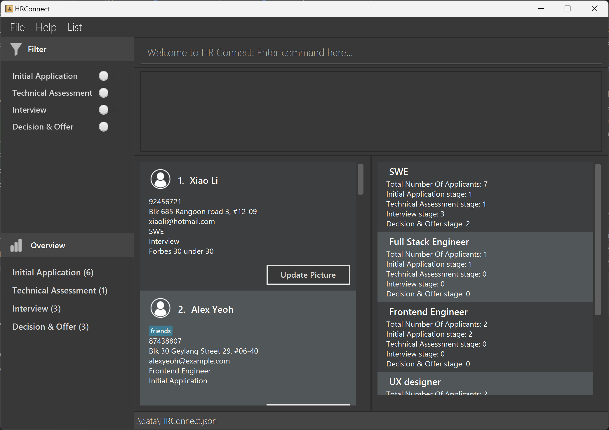
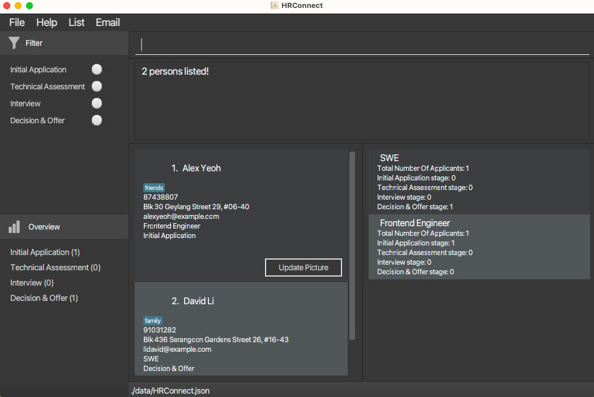
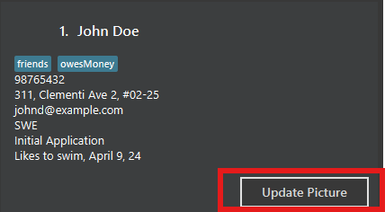

**HRConnect is a Command Line Interface (CLI) optimized desktop application designed for storing contacts of potential hires, hiring agencies, and legal consultants.**
By using commands, HR officers can efficiently organize contacts for their recruiting process.

* Table of Contents
  {:toc}

--------------------------------------------------------------------------------------------------------------------

## Quick start

1. Ensure you have Java `11` or above installed in your Computer.

1. Download the latest `HRConnect.jar` from [here](https://github.com/AY2324S2-CS2103-F15-3/tp/releases).

1. Copy the file to the folder you want to use as the _home folder_ for your HRConnect.

1. Open a command terminal, `cd` into the folder you put the jar file in, and use the `java -jar HRConnect.jar` command to run the application. A GUI similar to the below should appear in a few seconds.
   

1. Under the side panel Filter, users can choose the stage to view only applicants who are in that stage, ensuring that only applicants in the selected stage are displayed in HRConnect. Users can opt to select 0, 1, 2, 3 or all 4 radio buttons. Multiple selections are allowed so that HR officers can efficiently view the applicants in the selected stages. Note that selecting 0 or 4 buttons will both give back the full list of applicants in all 4 stages. It is also important to note that using this Filter side panel will overwrite all commands. For instance, if you previously used the `find` command to `find John`, selecting the `Interview` Stage button will display the entire list of applicants in `Interview` Stage, not limited to those with John in their names.

1. The Overview side panel gives users a quick overview on the count of number of applicants in each stage. The Person List showcases the applicants in HRConnect while the Role List showcases the roles of those applicants. Note how the app contains some sample data. 

1. Type the command in the command box and press Enter to execute it. e.g. typing **`help`** and pressing Enter will open the help window. 
   Some example commands you can try:

    * `list` : Lists all contacts.

    * `add /name John Doe /phone 98765432 /email johnd@example.com /address 311, Clementi Ave 2, #02-25 /role SWE /tag friends` : Adds a contact named `John Doe` to the HRConnect.

    * `delete 3` : Deletes the 3rd contact shown in the current list.

    * `clear` : Deletes all contacts.

    * `exit` : Exits the app.

1. Refer to the [Features](#features) below for details of each command.

--------------------------------------------------------------------------------------------------------------------

## Features

**:information_source: Notes about the command format:** 

* When users input a command along with its arguments, it will be trimmed (remove leading whitespace, trailing whitespace, and whitespace in between words when there are more than one space).

* When parsing arguments: “John Doe “, “John   Doe”, and “   John   Doe” will all be converted to “John Doe”.

* When parsing commands: “/FILTER”, “/FILTER   Interview ”, “    /FILTER Interview   ” will all be converted to “/filter Interview”.

* Words in angle brackets `<>` are the parameters to be supplied by the user. 
  e.g. in `/filter <Tag>`, `<Tag>` is a parameter which can be used as `/filter Interview`.

* Items in square brackets are optional. 
  e.g `/name NAME [/tag TAG]` can be used as `/name John Doe /tag friend` or as `/name John Doe`.

* Parameters can be in any order for `add` and `edit` commands. 
  e.g. if the command specifies `/name NAME /phone PHONE_NUMBER`, `/phone PHONE_NUMBER /name NAME` is also acceptable.

* Parameters must be in strict order for `filter`, `note`, `export`, and `tag` command.

* Extraneous parameters for commands that do not take in parameters (such as `help`, `list`, `exit` and `clear`) will be ignored. 
  e.g. if the command specifies `help 123`, it will be interpreted as `help`.

* If you are using a PDF version of this document, be careful when copying and pasting commands that span multiple lines as space characters surrounding line-breaks may be omitted when copied over to the application.

### Viewing help : `help`

Shows a message explaining how to access the help page.

Format: `help`

### Add an applicant: `add`

Adds an applicant to HRConnect.

Format: `add /name Name /phone Phone_Number /email Email /address Address /role Role [/note Note] [/tag Tag]…​`

:bulb: **Note:**
* An applicant can have any number of tags (including 0)
* Email addresses are not case-sensitive, so storing in upper or lower case letters would not affect email services from sending to applicant.
* Stage input is not allowed here as stage is initialised to be Initial Application based on the workflow where newly added applicants start as so.

Examples:
* `add /name John Doe /phone 98765432 /email johndoe@gmail.com /address John street, block 123, #01-01 /role SWE /note Likes to swim`

### Listing all applicants : `list`

Shows a list of all applicants in the HRConnect.

Format: `list`

### Editing an applicant : `edit`

Edits an existing applicant in the HRConnect.

Format: `edit Index [/name Name] [/phone Phone] [/email Email] [/address Address] [/stage Stage]
[/note Note] [/role Role] [/tag Tag]…​`

* Edits the applicant at the specified `Index`. The index refers to the index number shown in the displayed applicant list. The index **must be a positive integer** 1, 2, 3, …​
* At least one of the optional fields must be provided.
* Existing values will be updated to the input values.
* When editing stage, note that the names of Stages can only follow one of the following four options:
    1. Initial Application
    2. Technical Assessment
    3. Interview
    4. Decision & Offer
* When editing tags, the existing tags of the applicant will be removed i.e adding of tags is not cumulative.
* You can remove all the applicant’s tags by typing `/tag` without
  specifying any tags after it.

Examples:
*  `edit 1 /phone 91234567 /email johndoe@example.com` Edits the phone number and email address of the 1st applicant to be `91234567` and `johndoe@example.com` respectively.
*  `edit 2 /name Betsy Crower /tag` Edits the name of the 2nd applicant to be `Betsy Crower` and clears all existing tags.

### Locating applicants by name: `find`

Finds applicants whose names contain any of the given keywords.

Format: `find Keyword [More_Keywords]`

* The search is case-insensitive. e.g `hans` will match `Hans`
* The order of the keywords does not matter. e.g. `Hans Bo` will match `Bo Hans`
* Only the name is searched.
* Only full words will be matched e.g. `Han` will not match `Hans`
* Applicants matching at least one keyword will be returned (i.e. `OR` search).
  e.g. `Hans Bo` will return `Hans Gruber`, `Bo Yang`
* To accommodate HR officers who deal with a large volume of applicants, executing
  `find` two or more times without clicking on the buttons on the Filter side panel, or using the `filter` command, or using the `list` command, or clicking on `Show All` on the `List` Panel will lead to an `AND` search between the keywords provided between the different `find` searches. However, this will not affect the `OR` search mentioned previously amongst the keywords provided in
  the same find command. 
  e.g. User first executes `find John` and the HRConnect will return all applicants with John in the name. If the user then executes `find Doe` after the previous find command, HRConnect will only return those with both John *and* Doe in their names. 
  e.g. User first executes `find John Yu` and the HRConnect will return all applicants with John or Yu in the name. If the user then executes `find Doe` directly after the previous find command, HRConnect will only return those with both John *and* Doe or those with both Yu *and* Doe in their names ie `John Yu` will not get returned.
* Clicking on the buttons of Stages on the side panel Filter before executing `Find` command will return applicants that match the keyword and in the selected stages.

Examples:
* `find John` returns `john` and `John Doe`
* `find alex david` returns `Alex Yeoh`, `David Li` 
  

### Deleting an applicant : `delete`

Deletes the specified applicant from the HRConnect.

Format: `delete Index`

* Deletes the applicant at the specified `Index`.
* The index refers to the index number shown in the displayed applicant list.
* The index **must be a positive integer** 1, 2, 3, …​

Examples:
* `list` followed by `delete 2` deletes the 2nd applicant in the HRConnect.
* `find Betsy` followed by `delete 1` deletes the 1st applicant in the results of the `find` command.

### Filtering applicants by stage : `filter`
Filter through contact list based on what stage the applicant is in.

Format: `filter /stage <ApplicantStage>`

* Filters the contact list based on the `<ApplicantStage>` provided.
* Possible values for `<Applicant>` are `Initial Application`, `Technical Assessment`, `Interview`, `Decision & Offer`.

Examples:
* `filter /stage Interview` filters the contact list to show only applicants in the Interview stage.

### Adding notes to applicants by tag : `/note`
Facilitates the addition of notes or comments to individual applicant entries.

Format: `note Index /note <Note>`

* Adds a note to the applicant at the specified `Index`.
* Incorporate supplementary notes to enrich the applicant's profile.
* Possible values for `Index` are positive integers.
* Possible values for `<Note>` are any non-empty string that provides relevant commentary.

Examples:
* `note 1 /note S/Pass Holder` will add the note “S/Pass Holder” to the applicant identified by Index 1.

### Searching applicants by notes : `search`
Search through contact list based on what note the applicant contains.

Format: `search /note <ApplicantNote>`

* Searches the contact list based on the `<ApplicantNote>` provided.
* Possible values for `<ApplicantNote>` can be any fully filled or partially filled note that exists within an Applicant in the current contact list.
* If no note is provided after the prefix `search /note`, the search result will return all applicants

Examples:
* `search /note Promising applicant` searches and fetches applicant with the note `Promising applicant`

#### Adding date to notes
* An optional `date` can be attached to the note when using the note command.
* When used, it will attach today's date to the note in `MMMM d, yy` format (e.g March 3, 24).
* Format: `note Index /note <Note> /date Flag`
* The possible values for `Flag` is `true` and `false` (case-insensitive).
* When `Flag` is set to `true`, a `date` will be attached to the note when displayed.

### Exporting applicants contacts : `export`
Use filter or find to isolate the applicants that match the desired stage or role or name. Export will then extract those applicants' contacts into an external JSON file.

Format: `export <FileName>`

* Achieve an additional layer of organisation to properly arrange contacts
* Specifying a `<FileName>` that already exists in the "data" folder will overwrite the existing one

Examples:
*  `export saved_contacts` will save contacts from the current page into an external JSON file named "saved_contacts.json" under the "data" folder.

### Importing applicants : `import`
Using `import` will open a dialog for user to select the json file to import.
The json file must be exported from HRConnect for it to be recognised.

### Importing applicants (CLI way) : `import_file Filepath`
Using `import_file` with valid Filepath pointing to the json file will directly import applicants without the dialog.
The json file must be exported from HRConnect for it to be recognised.

Example: `import_file C:\tp\data\interesting.json` will import applicants from the interesting.json
in the specified directory.

### Creating recurrent email templates : `Email`

Creates recurring email templates for the user to copy based on the application stage the user is targetting using the `Email` button on the Ui.

### Clearing all entries : `clear`

Clears all entries from the HRConnect.

Format: `clear`

### Exiting the program : `exit`

Exits the program.

Format: `exit`

### Saving the data

HRConnect data are saved in the hard disk automatically after any command that changes the data. There is no need to save manually.

### Editing the data file

HRConnect data are saved automatically as a JSON file `[JAR file location]/data/HRConnect.json`. Advanced users are welcome to update data directly by editing that data file.

:exclamation: **Caution:**
If your changes to the data file makes its format invalid, HRConnect will discard all data and start with an empty data file at the next run. Hence, it is recommended to take a backup of the file before editing it. 
Furthermore, certain edits can cause the HRConnect to behave in unexpected ways (e.g., if a value entered is outside of the acceptable range). Therefore, edit the data file only if you are confident that you can update it correctly.

### Updating applicant profile picture (Part of Planned Enhancement)
Each applicant has a `Update Picture` button, which enables the user to add a profile picture for a particular applicant.

**Note:** Due to buggy implementation of this feature, a very specific set of steps needs to be performed in order for this feature to work.
1. Before using this feature, use the `list` command at least once. This allows the `.json` file that stores the applicant information to be generated.
2. Press the `Update Picture` button and select an image (only image file types are supported, using other file types may corrupt the application).
3. After choosing an image, a popup should appear that explains to you that the application needs to be restarted for the changes to be reflected.
4. Restart the application, and you should be able to see the profile picture being updated.
5. In rare occasions, the feature may not work due to operating system complications.

## Command summary

Action | Format, Examples
--------|------------------
**Add** | `add /name Name /phone Phone_Number /email Email /address Address /role Role [/note Note] [/tag Tag]…​`   e.g., `add /name James Chow /phone 96622612 /email james@example.com /address 321, Clementi Ave 2, #02-25 /role Junior Engineer /note Likes to swim`
**Clear** | `clear`
**Delete** | `delete INDEX`  e.g., `delete 3`
**Edit** | `edit Index [/name Name] [/phone Phone] [/email Email] [/address Address] [/stage Stage] [/role Role] [/note Note] [/tag Tag]…​`  e.g., `edit 2 /stage Interview`
**Find** | `find Keyword [More_Keywords]`  e.g., `find alice bob charlie`
**List** | `list`
**Help** | `help`
**Exit** | `exit`
**Filter** | `filter /stage <ApplicantStage>`    e.g., `filter /stage Initial Application`
**Search** | `search /note <ApplicantNote>`   e.g.,  `search /note Promising applicant`
**Note** | `note <ApplicationId> /note <Note>`    e.g., `note 1 /note S/Pass Holder`
**Export** | `export <FileName>`   e.g., `export saved_contacts`
**Import** | `import`
**Import (CLI)** | `import_file Filepath`   e.g., `import_file C:\tp\data\interesting.json`